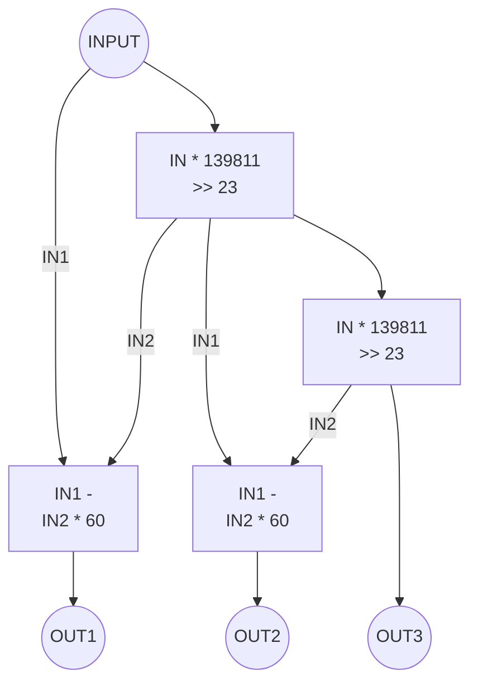
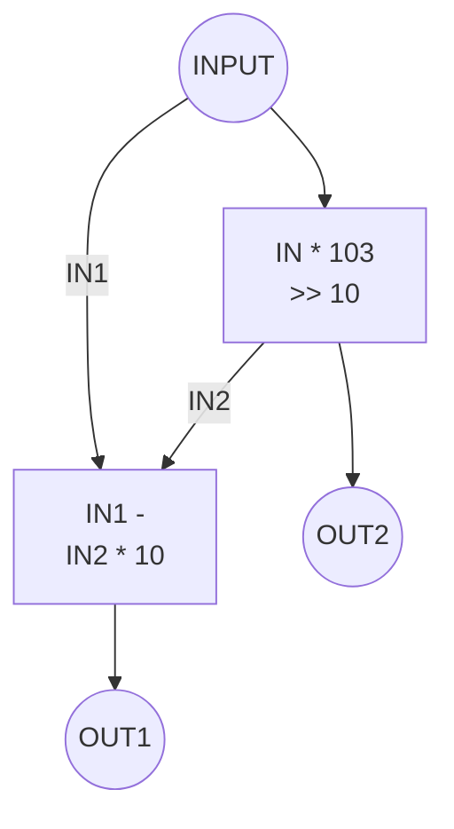
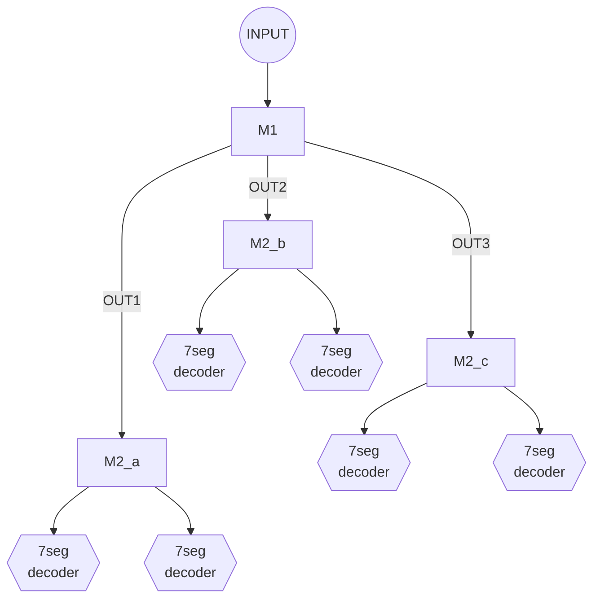

# Digital Clock in VHDL

Digital clock to be implemented on an Intel MAX10 FPGA.

## Component diagrams

### M1: S, M, H Splitter



### M2: Tens and Ones Splitter



### M3: Combined Circuit



## Proof of Concept

The concept can be demonstrated with the following python code:

```python
import time

def sub(IN1, IN2, multiplier = 60):
    return IN1 - IN2 * multiplier

def div(IN, multiplier = 139811, shift = 23):
    return IN * multiplier >> shift

def M1(seconds):
    minutes = div(seconds)
    OUT1 = sub(seconds, minutes)
    hours = div(minutes)
    OUT2 = sub(minutes, hours)
    OUT3 = hours
    return OUT3, OUT2, OUT1

def M2(IN):
    OUT2 = div(IN, multiplier = 103, shift = 10)
    OUT1 = sub(IN, OUT2, multiplier = 10)
    return OUT2, OUT1

def M3(seconds):
    return (M2(n) for n in M1(seconds))

seconds = 0
while True:
    # clears the screen using an ANSI escape codes
    print('\033[2J\033[H', end = '')
    print(*M3(seconds))
    seconds += 1
    time.sleep(1)

```
